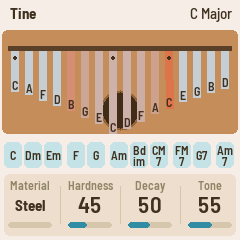
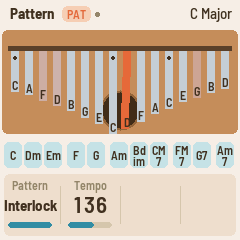
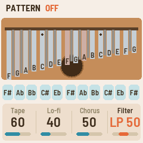
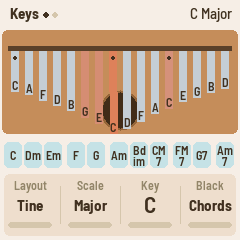
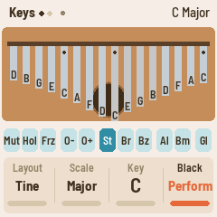
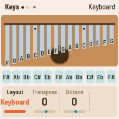
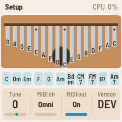
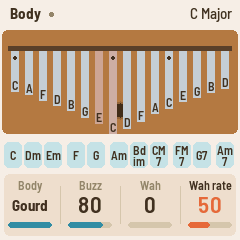
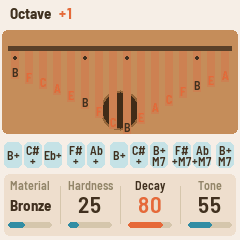

# FiMba-1: a kalimba for the M-VAVE FM-1

FiMba-1 is custom firmware that turns the **M-VAVE FM-1**, a palm-sized FM synthesizer, into a
**kalimba** (thumb piano). The name hides the FM-1 inside the word kalimba (Fi·M·ba), the way
FoMni, the firmware it grew from, hides FM inside Omnichord.

**▶ Play it in your browser: <https://jadamsowers.github.io/fm1-fimba/>** (no FM-1 needed: the
firmware's own C code compiled to WebAssembly, with mouse, touch, computer keyboard and MIDI input).

  

The 16 white keys are tines laid out as a real kalimba's are, with the lowest note in the middle.
The 11 black keys play thumb-roll chords, a chromatic second row, or performance moves. Each tine
is a physical model of a metal (or bamboo, or glass) bar. It sits on a body you can choose, with a
sound hole you can cover for the kalimba "wah" and buzzers like an mbira's. Behind that come a
granular cloud, a ping-pong delay, a plate reverb, tape and lo-fi colour, a chorus and a filter.
Mbira-style patterns can play over the chords you choose.

> **Status.** The firmware builds and passes its tests, and the browser version runs the same code,
> but this firmware **has not yet been run on a real FM-1**. Installing is at your own risk. The
> package is built so that the chip's own update mode can't be overwritten, and the firmware falls
> back to a safe mode if it can't start; see [Installing safely](#installing-safely).

---

## Contents

- [How we got here](#how-we-got-here)
- [Credits](#credits)
- [The controls](#the-controls)
  - [The panel at a glance](#the-panel-at-a-glance)
  - [Keys](#keys)
  - [Buttons](#buttons)
  - [Encoders and the MASTER knob](#encoders-and-the-master-knob)
  - [The pages and their knobs](#the-pages-and-their-knobs)
  - [The screen](#the-screen)
  - [MIDI](#midi)
- [How the kalimba works](#how-the-kalimba-works)
- [The browser version](#the-browser-version)
- [Building, testing, installing](#building-testing-installing)
- [Licence](#licence)

---

## How we got here

FiMba-1 sits at the end of a short chain of open-source firmware for the FM-1, each building on the
one before.

1. **The hardware.** The M-VAVE FM-1 is a small FM synthesizer: 27 keys (F3 to G5), 14 buttons, 7
   endless encoders and a volume knob, a 240 × 240 colour screen, USB-MIDI, and a TRS MIDI input,
   all run by a JieLi AC79 chip. M-VAVE's firmware is closed.
2. **[Felucca](https://github.com/hugelton/Felucca)** by Leo Kuroshita (Hügelton Instruments) made
   the FM-1 programmable. Its *platform layer* drives the chip directly: the keys, encoders, lights,
   screen, audio, USB, flash storage, an update loader that installs over USB-MIDI, a web installer,
   a safe boot and a rescue path. Felucca is a full synthesizer in its own right.
3. **[X0X](https://github.com/charlesvestal/fm1-x0x)** by Charles Vestal took Felucca's platform
   and built a different instrument on it. That showed the platform could carry any instrument, and
   added a host simulator so the whole firmware can run and be tested on a computer.
4. **[FoMni](https://github.com/charlesvestal/fm1-fomni)**, also by Charles Vestal, turned the FM-1
   into a chord harp after the Suzuki Omnichord. It kept the platform (by way of X0X), added a
   browser emulator, and is the closest relative of this project: FiMba-1 started as a fork of
   FoMni's tree.
5. **[FM-1+VA](https://baudgirl.com/work/FM-1+VA)** by Baudgirl, another custom FM-1 firmware, was
   one of the projects this one looked at for what's possible on the hardware.
6. **FiMba-1** keeps FoMni's platform almost unchanged. It replaces the instrument with a new one:
   the tine model, bodies, effects, patterns, music theory, the UI and its pages, and the tests.

FiMba-1 was built in conversation with Claude (Anthropic's AI model) in Claude Code. The person who
requested and shaped it chose the instrument, the controls and every refinement. Claude wrote the
code, tested it in the host simulator and the browser, and found and fixed problems along the way.
In rough order:

- The first version: modal tines, six materials, bodies, buzz, wah, grains, delay and reverb, three
  key layouts, three black-key modes, MIDI.
- A browser preview, then a version that runs as a single file from disk.
- The bodies, which at first barely changed the sound (under 2.5 dB), were rebuilt so each has its
  own character at the same loudness.
- The key layouts became two: **Tine** (the kalimba) and **Keyboard** (every key as printed).
- A reported "vinyl crackle" turned out to be three things: voices cut dead when a 13th note
  arrived, re-plucked tines jumping in one sample, and the delay and grain buffers clipping. All
  three were fixed and measured: the clicks are about 10,000× smaller, no sharper than a soft pluck.
- Tape, lo-fi, chorus, filter, pitch glide, just intonation and mbira patterns were added, each
  with tests that it doesn't click as it comes in or goes.
- The JieLi toolchain's download server was blocked on the network where this was built. The build
  scripts now fall back to the same toolchain from a Docker image, and to a GitHub mirror of the
  SDK files, which are checked against known hashes.

## Credits

| Who / what | What FiMba-1 uses | Licence |
|---|---|---|
| [Felucca](https://github.com/hugelton/Felucca), Leo Kuroshita (@kurogedelic), Hügelton Instruments | The platform: hardware layer (`firmware/hal/`), USB, storage, update loader, OTA, MIDI UART, LCD, drawing, build and packaging tools, the installer and rescue tools | GPL-3.0-only |
| [X0X](https://github.com/charlesvestal/fm1-x0x), Charles Vestal | The platform as adapted for a second instrument, the host simulator | GPL-3.0-only |
| [FoMni](https://github.com/charlesvestal/fm1-fomni), Charles Vestal | The tree this started from: boot, safe mode, panel map, project storage, the UI's frame (bands, knobs, autosave), the single-precision maths library, the plate reverb, the browser emulator | GPL-3.0-only |
| [FM-1+VA](https://baudgirl.com/work/FM-1+VA), Baudgirl | A reference for what the hardware can do | — |
| Jon Dattorro, "Effect Design, Part 1" (JAES, 1997) | The plate reverb's design | — |
| [Groove OS](https://www.groove-os.com/) | The idea of running FM-1 firmware in the browser (credited by FoMni; no code) | — |
| Barlow (The Barlow Project Authors), Terminus (Dimitar Toshkov Zhekov) | The screen's fonts | SIL OFL 1.1 |
| JieLi AC79 SDK | Three small files placed in the package at build time (not in this repository) | Apache-2.0 |
| [enix223/build-jieli](https://github.com/enix223/jieli-docker-build-env), [amitv87's SDK mirror](https://github.com/amitv87/fw-AC79_AIoT_SDK) | Fallback sources for the toolchain and SDK files when JieLi's servers can't be reached | — |
| [FM-1-transporter](https://github.com/kurogedelic/FM-1-transporter), [jl-uboot-tool](https://github.com/kagaimiq/jl-uboot-tool) | The protocol and flash loader behind the rescue tool (via Felucca) | — |

The details are in [LICENSING.md](LICENSING.md). FiMba-1 isn't affiliated with or endorsed by
M-VAVE, Hügelton Instruments, Charles Vestal or Baudgirl.

---

## The controls

### The panel at a glance

```
 ┌──────────────────────────────────────────────────────────────────────────────────┐
 │  MASTER   SELECT          ┌──────────┐    KNOB 1   KNOB 2   KNOB 3   KNOB 4       │
 │   (vol)  (material)       │          │                                          │
 │                           │  screen  │    FX   SEL   ENV   LFO   EDIT  GLO       │
 │ PRESETS  ALGORITHM        │ 240×240  │   HOME  SAVE  ARP   SEQ   PLAY  REC       │
 │ (key/    (scale)          │          │                                          │
 │  transpose)               └──────────┘                                          │
 │   [OCT−]  [OCT+]                                                                 │
 │   ┌──────────────────────────────────────────────────────────────────────────┐   │
 │   │  black keys:  1 2 3   4 5   6 7 8   9 10   11                              │   │
 │   │  white keys:  1 2 3 4 5 6 7 8 9 10 11 12 13 14 15 16    (F3 … G5)        │   │
 │   └──────────────────────────────────────────────────────────────────────────┘   │
 └──────────────────────────────────────────────────────────────────────────────────┘
```

### Keys

What the keys do depends on the **Layout** (Keys page).

**Tine layout** (the default) is a 17-key kalimba in C, laid out as on the instrument. The lowest
tine is in the middle and the scale alternates outward, left, right, left, right. Each thumb gets
every other note, and thirds sit side by side.

| White key | 1 | 2 | 3 | 4 | 5 | 6 | 7 | **8** | 9 | 10 | 11 | 12 | 13 | 14 | 15 | 16 |
|---|---|---|---|---|---|---|---|---|---|---|---|---|---|---|---|---|
| In C major | C6 | A5 | F5 | D5 | B4 | G4 | E4 | **C4** | D4 | F4 | A4 | C5 | E5 | G5 | B5 | D6 |

Scale and Key change the notes. The lowest tine always sits between F♯3 and F4, so a kalimba in C
starts on C4 and one in B on B3; OCT−/OCT+ move it.

In the Tine layout, the **black keys** do what **Black** says (Keys page, KNOB 4):

- **Chords** (default): each key rolls a chord across the tines the way a thumb slides over them
  (root, third, fifth, octave), **Strum ms** apart. The first seven keys are the triads on the
  scale's seven degrees (C, Dm, Em, F, G, Am, Bdim in C major). The last four are sevenths on I, IV,
  V and vi (CM7, FM7, G7, Am7). The chords follow the scale.
- **Sharps**: a chromatic kalimba's second row. Each black key plays the tine of the white key to
  its left, a semitone up.
- **Perform**:

  | Black key | 1 (F♯3) | 2 (G♯3) | 3 (A♯3) | 4 (C♯4) | 5 (D♯4) | 6–11 (F♯4 … F♯5) |
  |---|---|---|---|---|---|---|
  | Does | Mute every tine | Cover the sound hole while held | Freeze the grains | Octave down while held | Octave up while held | Steel, Brass, Bronze, Aluminium, Bamboo, Glass |

 

**Keyboard layout** is a chromatic kalimba with a tine for every key. All 27 keys, white and
black, play the note printed on them, F3 on the lowest up to G5. **Transpose** (±12 semitones) and
the octave shift them.



The FM-1's keys report only on and off, not how hard they're struck, so every key plucks at the
same strength. **Hardness** sets how firm that pluck is. Over MIDI, velocity sets it.

### Buttons

| Button | What it does |
|---|---|
| **HOME** | The Tine page |
| **ENV** | The Body page |
| **FX** | The Space page |
| **LFO** | The Grain page |
| **SEL** | The Keys page |
| **SEQ** | The More page |
| **GLO** | The Setup page |
| **EDIT** | The next page, including two that have no button of their own: **Color** and **Pattern** |
| **PLAY** | Freeze the grain cloud (it keeps playing what's in its buffer); again to go live. Lit while frozen. |
| **REC** | Palm mute: damps every tine at once |
| **ARP** | The mbira pattern on and off (see [Patterns](#patterns)). Lit while it runs, dark on each beat. |
| **OCT− / OCT+** | Octave down / up (−2 to +2) |
| **SAVE** | Save now. Settings also save themselves about four seconds after a change, once everything is quiet. |
| **OCT− + OCT+, held 5 s** | Update mode (to install firmware) |
| **OCT− + OCT+, held at power-on** | Hardware calibration: the screen asks for each button and knob in turn |

### Encoders and the MASTER knob

| Control | What it does |
|---|---|
| **MASTER** | Volume |
| **SELECT** | Material (Steel, Brass, Bronze, Aluminium, Bamboo, Glass) |
| **ALGORITHM** | Scale |
| **PRESETS** | Key in the Tine layout, Transpose in the Keyboard layout |
| **KNOB 1–4** | The four values on the current page. Turning quickly moves in bigger steps. |

### The pages and their knobs

Each page puts four values on KNOB 1–4. The values are saved with your settings.

**HOME: Tine**, the tine itself

| Knob | Range (default) | What it does |
|---|---|---|
| Material | Steel, Brass, Bronze, Aluminium, Bamboo, Glass (Steel) | What the tines are made of: their overtones, sustain and brightness ([below](#materials)) |
| Hardness | 0–100 (45) | How the tine is plucked: 0 is the soft pad of a thumb (round, few overtones), 100 a fingernail (bright, with a click) |
| Decay | 0–100 (50) | How long the tines ring, from about a quarter to four times their natural sustain |
| Tone | 0–100 (55) | How fast the upper overtones die away: low is dark and mellow, high keeps them ringing |

**ENV: Body**, what the tines sit on

| Knob | Range (default) | What it does |
|---|---|---|
| Body | None, Board, Box, Gourd (Box) | None: the bare tine. Board: a plank, thin and bright, with a woody knock. Box: a hollow box with a sound hole, warm, with a bloom around 200 Hz. Gourd: a calabash resonator, boomy, hollow and dark. All at about the same loudness. |
| Buzz | 0–100 (0) | Mbira buzzers (bottle caps, shells) that rattle when the body moves past a threshold |
| Wah | 0–100 (0) | How much of the sound hole a finger covers: the hole's resonance drops and darkens (Box and Gourd only) |
| Wah rate | Hand, 1–100 (Hand) | Hand: the hole moves only with the Wah knob, the mod wheel, pressure or the Hole key. Above that, a hand fluttering over it, 0.1 to 8 Hz. |

**FX: Space**

| Knob | Range (default) | What it does |
|---|---|---|
| Reverb | 0–100 (30) | How much goes to the plate reverb |
| Size | 0–100 (60) | The reverb's decay, a small room to a long hall |
| Delay | 0–100 (0) | The echoes' level |
| Time | 40–740 ms (330) | The time between echoes, left and right in turn (ping-pong) |

**LFO: Grain**, a granular cloud made from what you've just played

| Knob | Range (default) | What it does |
|---|---|---|
| Grains | 0–100 (0) | The cloud's level |
| Grain ms | 20–500 (140) | How long each grain lasts |
| Density | 1–60 a second (14) | How many grains start each second |
| Pitch | −12, −7, 0, +7, +12, +19, Shimmer, Reverse (+12) | The grains' pitch in semitones. Shimmer mixes unison, fifth and octave at random; Reverse plays them backwards. |

**SEL: Keys**: Layout, Scale, Key, Black in the Tine layout; Layout, Transpose, Octave in Keyboard

| Knob | Range (default) | What it does |
|---|---|---|
| Layout | Tine, Keyboard (Tine) | [Keys](#keys) |
| Scale | Major, Minor, Penta, Penta m, Dorian, Mixolydian, Lydian, Harmonic minor, Hirajoshi, Blues, Mbira, Chromatic (Major) | The tines' scale (Tine layout). Mbira approximates a Shona *Nyamaropa* tuning, close to an equal seven-step octave with a near-pure fifth. |
| Key | C–B (C) | The tonic (Tine layout) |
| Black | Chords, Sharps, Perform (Chords) | What the black keys do (Tine layout) |
| Transpose | −12–+12 (0) | Shifts the Keyboard layout in semitones |
| Octave | −2–+2 (0) | The same as OCT−/OCT+ |

**SEQ: More**

| Knob | Range (default) | What it does |
|---|---|---|
| Feedback | 0–95 (45) | How many echoes: each is this fraction of the one before |
| Spray | 0–100 (30) | How scattered the grains are in position, timing, pitch and pan |
| Strum ms | 0–120 (30) | The time between the notes of a black-key chord roll |
| Release | Ring, Damp (Ring) | Ring: a tine keeps ringing after you let go, as on a real kalimba. Damp: letting go puts a finger on it. |

**GLO: Setup**

| Knob | Range (default) | What it does |
|---|---|---|
| Tune | −50–+50 cents (0) | Fine tuning |
| MIDI ch | Omni, 1–16 (Omni) | The channel MIDI is received on |
| MIDI out | Off, On (On) | Send the keys as MIDI notes |
| Width | 0–100 (70) | Stereo width: the tines' spread from left to right, and the grains' and echoes' |

The Setup page's header shows the audio load (**CPU %**) and counts any dropouts, so you can check
the firmware's load on the hardware.

**EDIT → Color**: colour on the whole sound

| Knob | Range (default) | What it does |
|---|---|---|
| Tape | 0–100 (0) | Wow (a slow pitch waver), flutter (a fast one) and drift, up to about 12 cents, and tape saturation |
| Lo-fi | 0–100 (0) | A cheaper machine: the top rolls off (down to about 2.8 kHz), the stereo image narrows, and there's hiss that fades to silence when the music stops |
| Chorus | 0–100 (0) | A slow stereo ensemble on the instrument, before the echoes and the reverb |
| Filter | LP 100 … Off … HP 100 (Off) | Left of centre a low-pass sweeping down to about 200 Hz; right a high-pass up to about 4 kHz; more resonant the further it goes |

Every one of these fades in and out without a click, including turning the filter straight through
centre.

**EDIT → Pattern**

| Knob | Range (default) | What it does |
|---|---|---|
| Pattern | Thumbs, Cascade, 3 over 2, Interlock (Thumbs) | Which mbira pattern ARP plays ([below](#patterns)) |
| Tempo | 40–200 BPM (96) | The pattern's tempo, three pulses to a beat. MIDI clock takes over while it comes in. |
| Glide | 0–100 (30) | How far a hard pluck starts sharp: up to 40 cents, settling in about 50 ms |
| Tuning | Equal, Just (Equal) | Just: pure 5-limit intervals over the key (Tine) or over the C key (Keyboard). The Mbira scale keeps its own tuning. |

### The screen

  

- **Header:** the page's name, with tags: **FRZ** when the grains are frozen, **PAT** when a
  pattern runs (bright on the beat), **DAMP** when Release is Damp. A dot means unsaved changes. On
  the right is the key and scale, or "Keyboard" and its transpose (or the CPU load on Setup).
  Messages such as "SAVED" or "OCTAVE +1" take the header's place for a moment.
- **The instrument:** a kalimba seen from above. The body's wood holds the sound hole, which
  shrinks as it's covered, and the bridge. Each tine's length is that of a real tine at its pitch
  (a tine's frequency goes as 1/length²). A tine glows and swings while it rings, and each shows its
  note letter, with sharps and flats tinted. A dot marks the tonic. In the Keyboard layout the black
  keys' tines are a narrower second row between the white ones.
- **The black-key strip:** what each black key plays: its chord, its note, or its Perform role. It
  lights while held.
- **The knobs band:** the page's four values, each with its name, value and a bar. The one you
  turned is highlighted for a moment.

### MIDI

MIDI comes in over USB and the TRS jack, on the Setup page's MIDI channel (Omni by default).

| Message | What it does |
|---|---|
| Note on | Plucks the tine of that pitch at that velocity (with Tuning and Tune applied). With a pattern running, the notes held become its chord instead. |
| Note off | Damps the tine when Release is Damp |
| CC 1 (mod wheel), channel pressure | A finger over the sound hole (the wah) |
| CC 64 (sustain) | Holds damps back until the pedal lifts |
| CC 72 / 73 / 74 | Decay / Hardness / Tone |
| CC 91 / 93 / 94 | Reverb / Grains / Delay |
| CC 120, CC 123 | Damp everything |
| Program change | Material (0–5, wrapping) |
| Pitch bend | ±2 semitones, on every ringing tine |
| Clock, Start, Continue, Stop | The pattern follows the clock: Start resets the cycle, Stop holds it |

**Out** (on by default): the keys are sent as notes on the Setup channel (channel 1 when Omni).

---

## How the kalimba works

### The tine

A kalimba tine is a metal bar clamped at one end and free at the other. Plucked, it vibrates at
several *modes* at once. Unlike a string's, they aren't harmonics: on a uniform clamped-free bar
they sit at 1, 6.27, 17.55 and 34.39 times the fundamental. That inharmonic spectrum is the "ping"
of a kalimba.

FiMba-1 models each sounding tine as a bank of five **resonators**, each a two-pole filter that
rings at one mode and decays at that mode's rate:

- **The fundamental**, and a **twin** a hair above it. A real tine bends in two planes at slightly
  different frequencies, and the two beat slowly against each other.
- **Three upper modes**, which die away faster than the fundamental (Tone sets how much faster).

Twelve tines can ring at once. A thirteenth note takes over the quietest, which fades out over 6 ms
rather than being cut. A tine plucked again while it rings is the same vibrating bar: the thumb
lands, damps it over a few milliseconds, and slips off into the new pluck.

**The pluck** is the force on the tine as it slips off the thumb: a short pulse, 1.2 ms for the soft
pad of a thumb down to 0.05 ms for a nail. A long pulse can't excite the high modes, so a soft
pluck is round; a short one rings them all and adds a small click. **Glide** adds the pitch rise of
a tine plucked hard: the wide swing stretches the bar, and the pitch settles as the swing narrows.

### Materials

| Material | Modes (× the fundamental) | Character |
|---|---|---|
| Steel | 1, 5.9, 16.2, 31.5 | The classic kalimba: long sustain, a clear "ping" from the second mode, a slow beat |
| Brass | 1, 5.6, 15.3, 29.8 | A softer metal: lower overtones, warmer and shorter |
| Bronze | 1, 2.76, 5.40, 8.93 | Played as a bar free at both ends: bell-like |
| Aluminium | 1, 6.27, 17.55, 34.4 | The ideal clamped-free bar: bright and tinny, a quicker decay |
| Bamboo | 1, 4.6, 11.8, 22.3 | High internal loss: a short, woody knock (as on array mbiras) |
| Glass | 1, 3.01, 6.24, 10.4 | Hardly any damping of the upper modes: crystalline |

A real tine is bent up and thinner at the tip, which pulls its modes below the ideal bar's, more so
in soft brass. Higher tines decay faster than low ones.

### The body

The tines' sound passes through the body:

- **Tone shaping** of the direct sound. A plank radiates little bass; a box warms the sound; a gourd
  makes it hollow and dark.
- **Four resonances.** The first is the **air mode** of the sound hole (a Helmholtz resonance, like
  blowing across a bottle); the others are the wood's or the shell's own modes. Covering the hole
  lowers and darkens the air mode, since its frequency follows the square root of the open area.
  That's the kalimba's "wah".
- **The knock.** Each pluck's force reaches the body as well as the tine.
- **Buzzers** rattle when the body moves past a gap, never quite the same twice.

### The signal path

```
 tines ─► body + buzz ─► chorus ─┬─────────────────────────────────┬─► filter ─► tape / lo-fi ─► MASTER ─► out
                                 ├─► grain cloud (record, freeze) ─┤
                                 ├─► ping-pong delay ──────────────┤
                                 └─► plate reverb ─────────────────┘
```

- **Grains** are cut from a 1.1 s recording of the dry sound. Each one is windowed so it fades in
  and out, and played at its own pitch, position and pan. Freeze stops the recording, so the cloud
  keeps playing what it holds.
- **The delay** is a ping-pong of up to 740 ms, darkened a little on each repeat, like tape.
- **The reverb** is a plate after Jon Dattorro's design (FoMni's code).
- **The delay and grain buffers** are stored at reduced level through a soft limiter, so loud
  chords can't clip them.
- **The filter and tape** act on everything, reverb tails included. Their settings glide sample by
  sample, and the filter keeps running when it's off (faded out), so switching it in, out or
  through centre never clicks.

### Patterns

ARP plays mbira-style patterns: a cycle of 12 pulses, three to a beat. Each pulse plucks up to two
tines, chosen by their role in the chord:

- **the left thumb's bass tines**: the chord's root and fifth, an octave down, panned left;
- **the right thumb's treble**, climbing through the chord's tones and their octaves (never more than
  two octaves above its root), panned right.

The first pulse of the cycle is accented, and no two plucks are quite the same strength. The four
patterns:

- **Thumbs**: left and right in turn, the bass under a treble line that rises and falls.
- **Cascade**: down the tines, into the bass, and back up.
- **3 over 2**: the bass every three pulses against the treble every two, a hemiola.
- **Interlock**: two parts woven together, the second answering between the first's notes, six
  pulses later and a tine higher. This is the way mbira players pair a lead part (*kushaura*) with
  an interlocking one (*kutsinhira*).

**The chord** comes from whichever of these you use:

- a chord key (Tine layout, Black on Chords): it sets the chord without its roll;
- the keys you hold (Keyboard layout): pressing a new hand of keys starts a new chord;
- the MIDI notes you hold.

It keeps playing after you let go, until you pick another chord or press ARP. In the Tine layout
the white keys still play over it. With no chord picked yet, ARP starts on the key's own chord.

### Tuning

- **Equal** is ordinary equal temperament.
- **Just** retunes each note to the pure ratio of its interval over the tonic: 16/15, 9/8, 6/5,
  5/4, 4/3, 45/32, 3/2, 8/5, 5/3, 9/5, 15/8. A major third, for example, is 14 cents flatter than
  in equal temperament and beats far less in chords.
- The Mbira scale has its own tuning and is left as it is.

---

## The browser version

**<https://jadamsowers.github.io/fm1-fimba/>**: the firmware's UI and sound engine compiled to
WebAssembly, running at the FM-1's 44.1 kHz in an AudioWorklet. What you hear is the same physical
model the FM-1 would run.

- **Mouse and touch:** drag a knob up or down, or scroll over it. Click or touch keys and buttons;
  several fingers work on a touch screen. Shift-click (or right-click) a button to hold it down.
- **Computer keyboard:**
  - **Keys:** white keys 1–8 are <kbd>Q</kbd>–<kbd>I</kbd>, white keys 9–16 are <kbd>A</kbd>–<kbd>K</kbd>,
    and black keys 1–11 are <kbd>1</kbd>–<kbd>0</kbd> and <kbd>-</kbd>.
  - **Buttons:** <kbd>Space</kbd> freeze, <kbd>Enter</kbd> mute, <kbd>Esc</kbd> HOME,
    <kbd>Z</kbd>/<kbd>X</kbd> OCT−/OCT+.
  - **Material:** <kbd>↑</kbd>/<kbd>↓</kbd>.
- **MIDI:** "Connect MIDI" uses Web MIDI (Chrome or Edge).
- **Saving:** SAVE keeps your settings in that browser.

The site is rebuilt and published by GitHub Actions whenever a change reaches `main`. Every pull
request is built and tested first ([below](#continuous-integration)). To build it yourself (needs
Emscripten), run `web/emu/build.sh`. It makes `build/emu/`, including `build/emu/FiMba-1.html`, all
of it in one file that runs straight from disk.

---

## Building, testing, installing

The details are in [BUILDING.md](BUILDING.md). In short:

```
python3 -m venv .venv && .venv/bin/pip install -r requirements.txt && source .venv/bin/activate
tests/run_tests.sh                     # the engine, the platform pieces, the whole app in a simulator
./build.sh                             # build/fimba.fwsc (needs JieLi's toolchain and SDK files: BUILDING.md)
python3 tools/fm1_install.py --info    # check the installer finds your FM-1 (writes nothing)
python3 tools/fm1_install.py build/fimba.fwsc
```

Or download a ready-built package from the [releases](https://github.com/jadamsowers/fm1-fimba/releases).

- **The host simulator** (`build/host/kalimba_host SCRIPT OUTDIR`) runs the whole firmware on a
  computer from a script (`tests/scenarios/*.kal`): screenshots, audio and the MIDI it sends come
  out. The screenshots in this README are its output.
- **The engine test** (`tests/host/kalimba_test.c`) is built without the maths library, as on the
  device. It checks:
  - every material's pitch to a few cents;
  - decays, damping, voice stealing, the bodies;
  - that nothing clicks;
  - every effect, the patterns and MIDI clock, and a 20-minute run;
  - and it writes one WAV per material to `build/host/materials/`.

### Installing safely

- **The recovery path can't be overwritten.** The first 16 KiB of flash hold the chip's own boot
  code and update mode. The update loader never writes there, so even a firmware that crashes at
  once can't remove the way back.
- **A firmware that can't start falls back.** After two failed starts the FM-1 comes up in **safe
  mode** (no sound, USB on, the installer works). After four it enters the chip's own update mode.
- **The package can be checked.** `tools/check_fwsc.py` takes a package apart, verifies every CRC,
  and compares it region by region with FoMni's own package. Everything but the app is
  byte-identical (see BUILDING.md, "Before installing").
- **Have stock firmware ready.** Before the first install, download M-VAVE's stock firmware (FM-1
  V15, "PC Firmware" at m-vave.com/download). `tools/fm1_rescue.py` puts it back if the FM-1 ever
  ends up in a crash loop, and FoMni's web installer can also restore it.

### Continuous integration and releases

`.github/workflows/web.yml` has two build jobs:

- **Tests and the web app**, in the official Emscripten container: the full test suite, then the
  browser version.
- **Firmware package**, on Linux:
  - It fetches JieLi's toolchain (`tools/get_toolchain.sh`) and the three SDK files
    (`tools/get_sdk.sh`, SHA-256 checked).
  - It builds `fimba.fwsc`.
  - It builds FoMni's own package at a pinned commit and checks that everything but the app is
    byte-identical (`tools/check_fwsc.py`).
  - It runs the update-loader, OTA-entry and installer tests against the package.

When each part runs:

| When | What happens |
|---|---|
| A pull request | Both jobs; the firmware (`fimba-firmware`) and the one-file web app (`FiMba-1-web`) can be downloaded from the run to try before merging |
| A push to `main` (a merged pull request) | Both jobs, then the browser version is published to GitHub Pages |
| A tag `vX.Y.Z` | A release build: the version shows on the splash screen, and the package identity is FM-1_8XXYYZZ. It's published as a [GitHub Release](https://github.com/jadamsowers/fm1-fimba/releases) with `fimba-X.Y.Z.fwsc` and `FiMba-1.html`. |

To make a release:

```
git tag v0.2.0 && git push origin v0.2.0
```

---

## Licence

GPL-3.0-only, the licence of Felucca, X0X and FoMni, which FiMba-1 is built on. See [LICENSE](LICENSE)
and [LICENSING.md](LICENSING.md). If you distribute FiMba-1 or firmware derived from it, you must
give your recipients its complete corresponding source under the same licence.

M-VAVE and FM-1 are trademarks of their owners. FiMba-1 is independent firmware.
